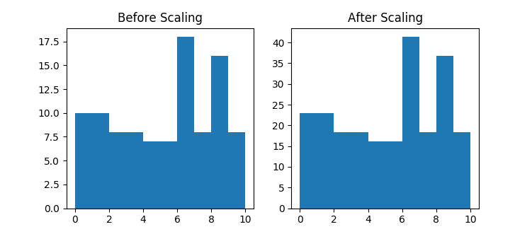
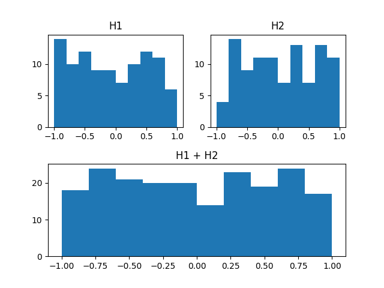
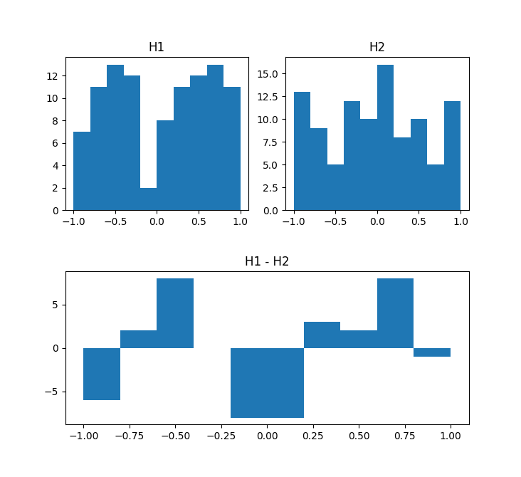
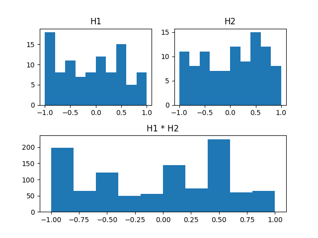
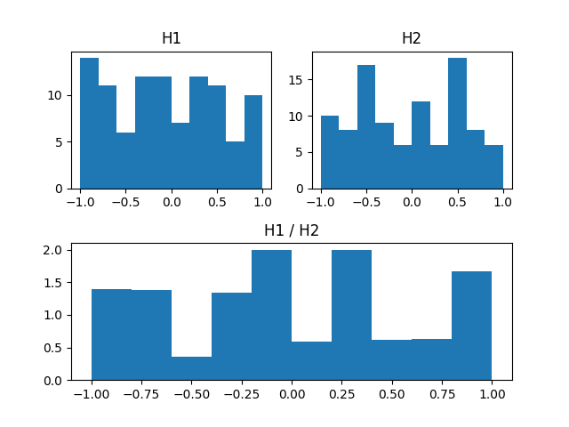
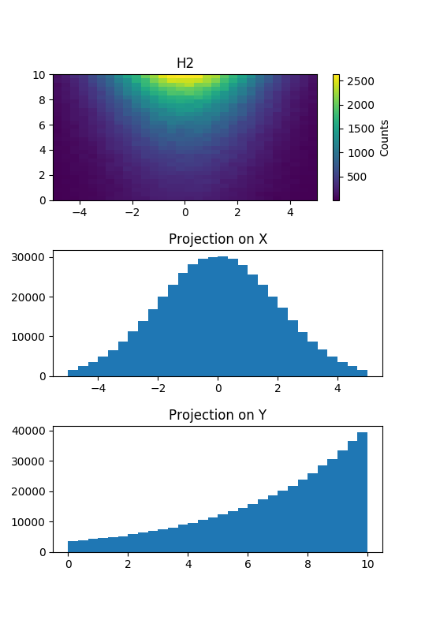

****************************
The Profile Histogram Module
****************************

This module contains classes for profile histograms. 

While histograms show the value filled in each their bin, profile histograms show the mean of the values and its root mean square filled in each bin.

The Profile Histogram Classes
=============================

This package provides full support for N-Dimensional profile histograms: :py:class:`ProfileND <rootplots.profile.ProfileND>` a class is derived from :py:class:`HistND <rootplots.hist.HistND>`

But for your convenience, there are also classes derived from :py:class:`ProfileND <rootplots.profile.ProfileND>` 
that are more convenient to use when you need lower dimensional profile histograms:

	* :py:class:`Profile1D <rootplots.profile.Profile1D>` for 1D profile histograms
	* :py:class:`Profile2D <rootplots.profile.Profile2D>` for 2D profile histograms
	* :py:class:`Profile3D <rootplots.profile.Profile3D>` for 3D profile histograms

Creating Profile Histograms
===========================

importing the library
---------------------

But first we must import the profile histogram module::

	from rootplots.profile import *

This command imports all classes defined in rootplots.profile module, which includes classes for 1D, 2D, 3D and ND profile histograms.

1D profile histogram
--------------------

The easiest profile histograms to create are **one dimensional** (:py:class:`Profile1D <rootplots.profile.Profile1D>`)::

	h = Profile1D(100, -3.0, 3.0)

Above we created a 1D histogram that contains *100 bins* starting from *-3.0* to *3.0*.

2D histogram
------------

To create **two dimensional** histograms (:py:class:`Hist2D <rootplots.profile.Hist2D>`) it gets a bit complex, because we must explicitly say how the bins are distributed on 2 axis.::

	h2 = Hist2D(100, -3, 3, 60, 0, 1000)

Here, we recongnize the first 3 arguments as representing the bin distribution on the first axis/dimension as we did previously for *h* . For the second axis, we can see that it has 60 bins starting from 0 and grow equally spaced till 1000.

3D histogram
------------

A bit more complex is to create **three dimensional** histograms (:py:class:`Hist3D <rootplots.profile.Hist3D>`)::

	h3 = Hist3D(100, -3, 3, 60, 0, 1000, 80, -5, 3)

To construct 3D histograms is basically the same as for 2D histograms with the added difference we need 3 more arguments to specify bin distribution on the third axis. Pretty simple!

ND histogram
------------
When we want to go to **higher dimensions** then 3 we must use the **N-Dimensional histogram class** (:py:class:`HistND <rootplots.profile.HistND>`). Here, the interface is a bit different since we must deal 
with **N** values for each parameter from the bin distribution. For this reason we must use *arrays* or *lists*::

	hN = HistND( N, minBins, maxBins, nBins)

Where *N* is the number of dimensions and the other arguments are arrays/lists. Where we understand that the *ith* element represents its value on *ith* dimension/axis. For example, a **5 dimensional histogram**::

	N=5
	mins = [0,0,0,0,0]
	maxis = [5,6,8,8,8]
	nbins = [5,6,8,10,10]

	h5 = HistND(N, mins, maxis, nbins)

or, simply::

	h5 = HistND(5, [0,-1,0,2,1], [5,6,8,8,11], [5,6,8,10,10])

We interpret as:

	- the histogram has 5 dimensions
	- the first axis has 5 bins starting from 0 till 5
	- the second axis has 6 bins starting from -1 till 6
	- the third axis has 8 bins starting from 0 till 8
	- the fourth axis has 10 bins starting from 2 till 8
	- the fifth axis has 10 bins starting from 1 till 11

.. warning::
	N-dimensional histogramming is very demanding of memory: a HistND with 8 dimensions and 100 bins per dimension needs more than 2.5GB of RAM!

the title of the histogram
--------------------------

There is one more argument that all histogram classes share it. We didn't show it because its not important to the histogramming functionality, the argument is the *title* of the histogram. This argument is only used to keep it around untill the moment of drawing the histogram. That's his only functionality.

Let's see an example on how to use **title** it in the constructor::

	h2 = Hist2D(100, -3, 3, 60, 0, 1000, title="Nch vs Pt")

Filling
=======

A histogram is useless if it is not filled. 

In this section we present the filling methods of histograms of different dimensions. 
First, we start with the simples methods. We kept the more advanced functionality in a subsection of it own at the end of this section.

1D histogram
------------

One can fill a 1-dimensional histogram by simply calling the :py:meth:`fill <rootplots.profile.Hist1D.fill>` method::

	h.fill(val)

This methods automatically searches the bin that can contain the value *val* and adds 1 to the counter of the bin. 

You can specify a weight using the :py:meth:`fill_w <rootplots.profile.Hist1D.fill_w>` method::

	h.fill_w(val, w)

Which automatically searches the bin that can contain the value *val* and adds the weight *w* to the counter of the bin.

.. note::
	Using the simple fill methods there is no need to say which bin you want filled, just a position that is inside a bin.

2D histogram
------------

The 2D histograms are filled similary to 1D case, with the exception  this time we must take care of 2 axis::

	h2.fill(valX, valY)

Now, the :py:meth:`fill <rootplots.profile.Hist2D.fill>` method automatically searches the bin on the first axis (alternatively called X-axis) that can contain the value *valX* and the bin on the second axis (aka called Y-axis) that can contain the value *valY* and adds 1 to the counter of the bin. 

.. note::
	You may wonder: since there are bins on X-axis and bins on Y-axis which bin its actually filled?

	The answear: None of those. Because those bins don't exists for the reason that internally, the histogram classes contain **N-dimensional cells** also known as **global linear bins** as you may find it in other parts of the documentation. These cells represent the intersection of the bins from all axis.

Respectively, there is a :py:meth:`fill_w <rootplots.profile.Hist2D.fill_w>` method for which you can specify a weight::

	h2.fill_w(valX, valY, w)

3D histogram
------------

Its obvious by now, the fill methods for the 3D histogram are::

	h3.fill(valX, valY, valZ)

respectively::

	h3.fill_w(valX, valY, valZ, w)

ND histogram
------------

When going above 3 dimensions one must use an n-dimensional histogram: :py:class:`HistND <rootplots.profile.HistND>`.

By now, you should noticed that for the above examples we filled the histogram's cells using positions and the arguments are simple variables. When we go to the general case (n-dimensional histogram) this is not enough. We must use arrays/lists as arguments to the fill methods and explicitly specify the meaning of the argument. So, there is **no fill method for the ND histograms**, instead there is :py:meth:`fill_pos <rootplots.profile.HistND.fill_pos>` which has the same meaning::

	p = [3.46, -0.33, 7.1, 2.28, 9]
	h5.fill_pos(p)

or, :py:meth:`fill_pos_w <rootplots.profile.HistND.fill_pos_w>` fills with weights::

	h5.fill_pos_w([3.46, -0.33, 7.1, 2.28, 9], 8)

The fill_pos method fills the bins (or the cell) that can contain the point defined at position p.

.. note::
	fill_pos does the same thing as the fill method and is available to all histograms. The fundamental difference is that fill is available only to histograms lower then 3D. Another difference is that fill_pos accepts only an array-like variable.

Advanced Filling Methods
------------------------

Untill now, we have seen some methods that histograms can use for filling:

 	- 2 methods for that histograms lower then 3D (fill & fill_pos) 
 	- 1 method for histograms higher then 3D (fill_pos)

These methods fill the histogram according to a position of a point that falls inside a bin. But, there are more ways to fill.

Use :py:meth:`fill_bins <rootplots.profile.HistND.fill_bins>` when you know the bins ids on each axis::

	mbins = [1,0,100,2,86,47]
	hist.fill_bins(mbins)

and :py:meth:`fill_bins_w <rootplots.profile.HistND.fill_bins_w>` with weight::

	mbins = [1,0,100,2,86,47]
	w = 34.2
	hist.fill_bins_w(mbins, w)

.. note::
	The argument is a list of bin indexes. The dimension of the list must be the same as the dimension of the histogram.
	The bin indexes start from 0 to MaxBinIndex-1. MaxBinIndex is known when creating the histogram.

Use :py:meth:`fill_cell <rootplots.profile.HistND.fill_cell>` when you know the cell index::

	icell = 34
	hist.fill_bins(icell)

and :py:meth:`fill_cell_w <rootplots.profile.HistND.fill_cell_w>` with weight::

	icell = 34
	w = 2.2
	hist.fill_cell_w(icell, w)

.. note::
	The cell index starts from 0 to MAX_CELL_IDX, where MAX_CELL_IDX is the product of all the bin counters from all dimensions.
	Meaning for a 5D histogram that contains `nbins=[5,6,8,10,10]` the `MAX_CELL_IDX=5*6*8*10*10`

Operations
==========

The histograms in this package support multiple operations done on them, such as Scaling, Adding, Substracting, Multiplying and Dividing between histograms.

Scaling
-------
Any histogram, whether its 1D, 2D, 3D or ND, can be scaled by a factor using the :py:meth:`scale <rootplots.profile.HistND.scale>` method.
Take the following example::

	# create a 1D histogram
	myhist = Hist1D(10, 0, 10)

	# fill the histogram
	for x in range(100):
		r = random.uniform(0,10)

		myhist.fill(r)

	# scale the histogram's bins by 2.3
	myhist.scale(2.3)

This method multiplies the internal bins (cells) by the value specified in the argument. The effect is visible in the above image where the vertical axis presents different values. Check a full example :doc:`examples/hist/hist_scale`

Adding histograms
-----------------

Histograms can be added by simply using the `+` operator::

	# add 2 histograms
	hSum = h1 + h2

	The plot of adding 2 histograms (top) and showing the resulted histogram (below). The plot was generated by the full example from :doc:`examples/hist/hist_add`

Substracting
------------

Histograms can be substracted by simply using the `-` operator::

	# substruct 2 histograms
	hDiff = h1 - h2

	The plot of substracting a histogram from another (top) and showing the resulted histogram (below). The plot was generated by the full example from :doc:`examples/hist/hist_diff`

Multiplying
------------

Histograms can be multiplied by simply using the `*` operator::

	# multiply 2 histograms
	hDiff = h1 * h2

	The plot of multiplying two histogram from another (top) and showing the resulted histogram (below). The plot was generated by the full example from :doc:`examples/hist/hist_mult`

Dividing
------------

Histograms can be divided by simply using the `/` operator::

	# divide 2 histograms
	hDiff = h1 / h2

	The plot of dividing two histogram from another (top) and showing the resulted histogram (below). The plot was generated by the full example from :doc:`examples/hist/hist_div`

Integrating
-----------

You can integrate the histogram (do the sum of the values of its internal cells multiplied with the volume described by its bins). 

To do the integration you have 3 ways or methods, they differ by the meaning of their arguments.

Use :py:meth:`integral_over_pos <rootplots.profile.HistND.integral_over_pos>` to do the integration over 2 position::

	p = [0.33, 4.61, 78.29, 11.2]
	q = [1.22, 3.2, 88, 27.0]
	h.integral_over_pos(p, q)

here *h* can be any dimensional histogram. The arguments *p* and *q* are two positions (arrays) and p < q.

Use :py:meth:`integral_over_bins <rootplots.profile.HistND.integral_over_bins>` when you know the bins::

	b1 = [0, 4, 5]
	b2 = [1, 1, 0]
	h.integral_over_bins(b1, b2)

here *h* can be any dimensional histogram. The arguments *b1* and *b2* are bins positions (arrays) and b1 < b2.

Use :py:meth:`integral <rootplots.profile.HistND.integral>` when you know the two cell indexes::

	c1 = 34
	c2 = 90
	h.integral_over_bins(c1, c2)

here *h* can be any dimensional histogram. The arguments *c1* and *c2* are cell indexes (integers) and c1 < c2.

Projections
===========

You can project any higher dimensional histogram to any lower dimensional histogram. The projection is also a histogram, containing less dimensions.

Projecting 2D histograms
------------------------

Projecting 2D histograms is easy::

	hproj = h2D.projectionX()

This projects a 2D histogram to its first axe (named X). The result *hproj* is a 1D histogram.

You can also project it on the second axe, called Y::

	hproj = h2D.projectionY()

	The 2D histogram above is projected along axes X and Y. See the full example :doc:`examples/hist/hist_proj`

Projecting 3D histograms
------------------------

Besides the usual projecting methods as seen for 2D histograms (:py:meth:`projectionX <rootplots.profile.Hist3D.projectionX>`, :py:meth:`projectionY <rootplots.profile.Hist3D.projectionY>`) we get specific methods for 3D such as :py:meth:`projectionZ <rootplots.profile.Hist3D.projectionZ>`. Also, we can make projections on multiple planes defined by different combinations of axis.

Thus, we get a projection on XY plane::

	hXYproj = h3D.projectionXY()

Or a projection on XZ plane::

	hXZproj = h3D.projectionXZ()

Or a projection on YZ plane::

	hYZproj = h3D.projectionYZ()

Projecting ND histograms
------------------------

We've seen how easy is to do projections for lower dimensional histograms.

When projecting higher dimensional histograms (HistND) we must be more explicit and specify which dimensions we keep while projecting. For example, when we used :py:meth:`projectionX <rootplots.profile.Hist3D.projectionX>` to project a 2D or 3D histogram on the X axis, the projection operation does this: **keep X axis** and all the rest axis are projected. When we used :py:meth:`projectionYZ <rootplots.profile.Hist3D.projectionYZ>` the projection operation **keeps Y & Z axis** and projects the rest (only X axis in this case). 

We must recognize a general projection algorithm can not contain the letters for N-dimensional histograms, we do not have that many letters. For this reason, we must specify an **array of axis indexes** the ones we want to keep. The first axis (called X) has index 0, Y is 1 and Z is 2.

Lets see some examples on how to project a 7 dimensional histogram::
	
	# create a 7 dimensional histogram
	h = HistND(7, [-1,0,0,0,0,0,0], [1,10,10,10,10,10,10], [10,10,10,10,10,10,10])

	# code to fill the histogram
	# ...
	# ...
	# ...

	# create a projection on the first axis (aka X)
	hXproj = h.projection([0])

	# create a projection on the second axis (aka Y)
	hYproj = h.projection([1])

	# create a projection on the 7th axis
	hproj = h.projection([6])

	# create a projection on XY
	hXYproj = h.projection([0,1])

	# create a projection on X and the 5th axis
	hX5proj = h.projection([0,4])

	# create a projection on XYZ
	hXYZproj = h.projection([0,1,2])

	# create a projection on XYZ and the 5th & 7th axis
	hproj = h.projection([0,1,2,4,6])

Drawing
=======

The Histogramming module's design is intended only for histogramming in order to let the user decide which library they prefer for plotting. Hence, this module has no drawing/plotting capabilities.

We recognized the need to plot easy and quickly and for this reason the rootplots package provides a separate module specifically created to quickly draw the histograms objects. Go read about it here.

Reference Documentation
=======================

.. toctree::
   :includehidden:
   :maxdepth: 2

   examples/profile/index
   reference_profile